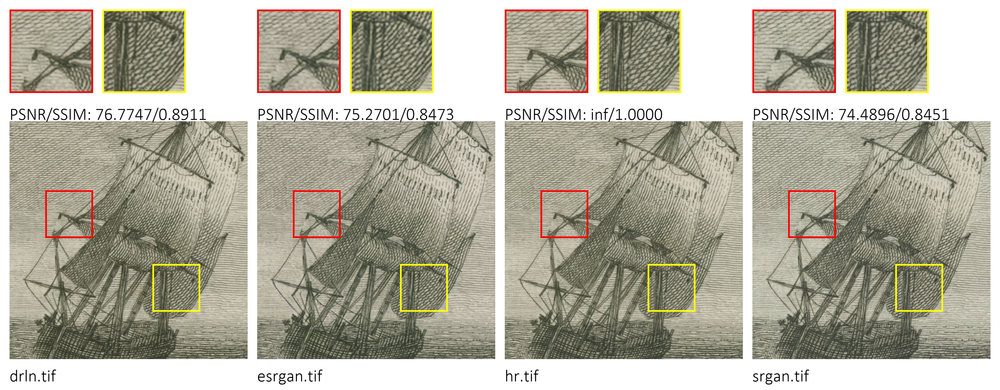

## An Exploration into Deep Learning based Super Resolution Techniques

This PyTorch based project is concerned with a novel case study of training and applying the following neural networks to  J. M. W. Turner prints.

* Densely Residual Laplacian Network (DRLN)
* Super Resolution GAN (SRGAN)
* Enhanced Super Resolution GAN (ESRGAN)

For this purpose two datasets have been created from > 15GB of raw high resolution scans (12000x7000 in some instances) of various Turner Prints. The following results have been trained with one of these datasets that contained 1000x1000 tiles from the original prints.

# Training Process

The following figures illustrate images produced during training iterations 1 to 150 from DRLN (right) and ESRGAN (left). The image was previously unseen by the training algorithm and is not included in the training data. 

  
  

# Results

The first image below is the test image used to produce the output that is being used in the last image. Please not that the images used in this Readme have been scaled (1:4) to fit the page but are true to size.
The resulting image also contains two crops from the images that were enlargened to improve visual evaluation, as well as two metrics per image, the Peak Signal to Noise Ratio (PSNR) and the Structural Similarity Index Measure (SSIM) to objectively evaluate the results obtained.

  

  

